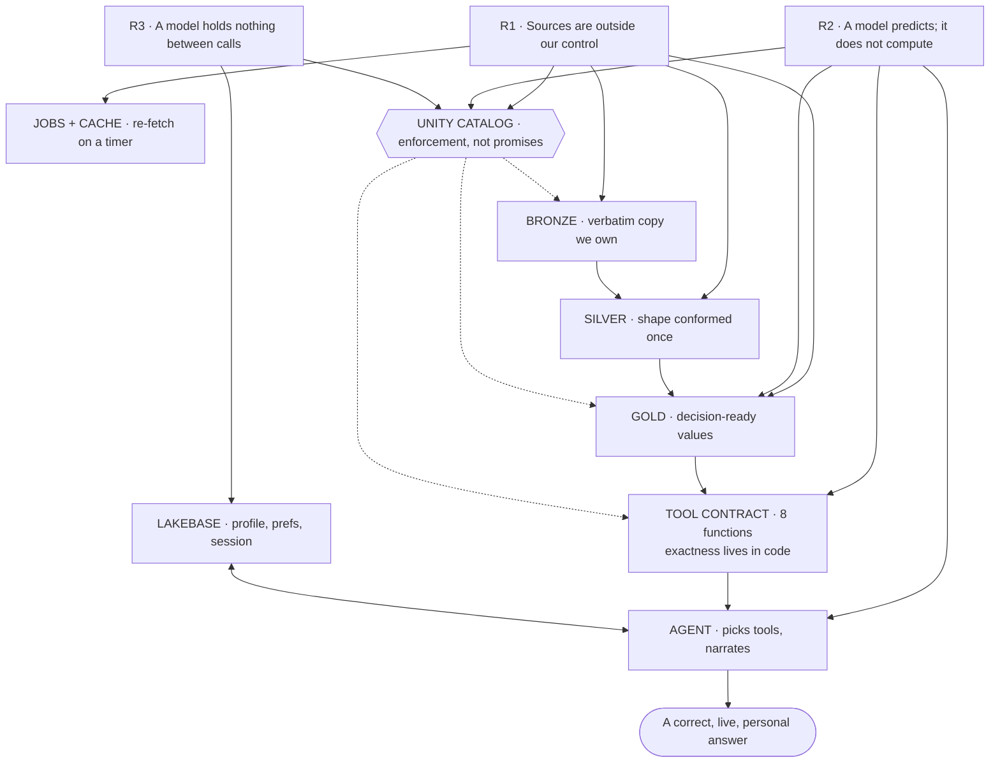

# SDD — HokieDay: Unified Campus-Life Agent

**Project:** HokieDay · **Event:** VTHacks 14 (Virginia Tech, Sep 18–20 2026)
**Sponsor track:** Deloitte × Databricks — Campus life intelligence hub
**Doc status:** v1.0 draft · **Author:** team · **Last updated:** 2026-09-19

> **Legend used throughout**
> ✅ **verified live** — I called this endpoint on 2026-09-19 and inspected the real payload.
> ⚠️ **assumed** — believed true, *not* yet verified. Must be verified before it appears in the pitch.
> ❌ **known gap** — confirmed absent; the design must route around it.

---

## 1. Executive summary

Virginia Tech students currently answer ordinary logistics questions — *"can I eat and still make my 1:25 lecture?"* — by hand, across four or more disconnected systems (dining menus, dining hours, bus schedules, live bus positions, weather, events). Each system is individually fine. **The integration layer does not exist**, and it is where student time is actually lost.

HokieDay is an AI agent that sits **above** those systems as an orchestration layer. It answers multi-constraint questions in one shot, and — the part that matters — it **re-plans when reality changes**, because a bus that is 4 minutes late invalidates the answer.

**Design thesis:** *squeeze every guarantee into code and structure, and leave the model only the fuzzy part it is actually good at.* The language model chooses tools and narrates results; it never invents a number.

**Prize context:** Deloitte × Databricks merch. The real return is sponsor attention, so the deliverable is framed as a **consulting engagement** (current state → future state → value case → phased roadmap), not a feature list.

---

## 2. Problem statement

### 2.1 The three questions that break a student's day

| Question | Systems required today | Failure mode |
|---|---|---|
| "Can I eat between these two classes?" | dining menu + dining hours + walking time | Gives up, skips lunch |
| "Which bus gets me there, and is it full?" | bus schedule + live positions + crowding | Misses the lecture |
| "What's happening on campus right now?" | events calendar + feed | Never finds out |

### 2.2 Why the existing tools don't solve it

Each campus app is **authoritative for one system and blind to the rest**. No vendor is incentivized to build the cross-system layer, because the value accrues to the *student*, not to any one system owner. That is precisely the gap an integration-layer agent fills — and it is why this is a strategy play, not a UI play.

### 2.3 Baselines (to be measured by the team, not assumed)

| Metric | Value | How to get it |
|---|---|---|
| Apps needed per decision | ~4 | count them, screenshot it |
| Minutes per decision | ~6 | stopwatch it, once, honestly |
| Decisions per student per week | ⚠️ unknown | survey 10 students on the floor (10 min) |

> **Do not fabricate these numbers.** A judge asking "where did 6 minutes come from?" must get "we timed it."

---

## 3. Goals & non-goals

### 3.1 Goals

| ID | Goal | Success looks like |
|---|---|---|
| G1 | Unify dining, transit, hours, weather, events behind one conversational interface | One question → one actionable plan |
| G2 | **Re-plan** when live state invalidates a plan | Agent states *what changed* and *why* |
| G3 | Be exact | Every number in an answer traces to a tool result |
| G4 | Be honest about data quality | UI labels degraded/stale/etc. |
| G5 | Present as a consulting engagement | Deck maps 1:1 to the stated judging criteria |

### 3.2 Non-goals (explicitly out of scope)

- ❌ Not a replacement for BT's or Dining's own apps — we orchestrate above them.
- ❌ No academic/grade/transcript data. Ever. (See §11.)
- ❌ No permanent infrastructure, auth, or real production deployment.
- ❌ Not a general-purpose campus chatbot — scope is the morning/afternoon logistics loop.
- ❌ Not an optimisation engine — we produce a *good* plan quickly, not a provably optimal one.

---

## 4. Architecture

### 4.1 The three roots (why every box exists)

Every component is a forced consequence of one of three facts. Nothing here is a preference or a style choice.

| ID | Unconditional truth | Forces |
|---|---|---|
| **R1** | Sources are outside our control — they change shape, go down, return garbage, and are live | bronze, silver, jobs, cache, fallbacks |
| **R2** | A language model predicts text; it does not compute | the tool contract, gold tables, the agent's restricted role |
| **R3** | A model holds nothing between calls | Lakebase, session state |



### 4.2 Layer responsibilities

| Layer | Responsibility | Proves |
|---|---|---|
| Bronze | Verbatim snapshot of every source, plus `_fetched_at` | Faithfulness to source |
| Silver | Parse, conform, join keys, type-cast, de-duplicate | Clean, joinable model |
| Gold | Pre-compute answers the agent needs: next departures, open-now, eat-options, crowding | Answer-ready, low-latency |
| Tool contract | 8 functions — the *only* way the agent touches data | Exactness, testability |
| Agent | Choose tools, sequence calls, re-plan, narrate | Reasoning, not arithmetic |
| Serving | Databricks App chat UI | Demo surface |
| State | Lakebase: profile, preferences, session | Personalisation across turns |

### 4.3 Why the division of labour is where it is

- **Data layers are pre-computed, not reasoned at read time.** A chat turn must return in seconds; scanning 74k stop_times per turn is both slow and non-deterministic.
- **Gold exists because R2.** The agent must be *handed* an answer-ready table, never asked to derive one.
- **Tools exist because R2.** Anything that must be exactly right happens in code. This is the single most important idea in the document.
- **Lakebase exists because R3.** A model with no memory cannot know your peanut allergy.

---

## 5. Data sources

### 5.1 Source registry

| # | Source | Endpoint | Status | Refresh |
|---|---|---|---|---|
| D1 | BT static GTFS | `http://www.bt4uclassic.org/gtfs/google_transit.zip` | ✅ 1.2 MB, valid, current | daily |
| D2 | BT live buses | `https://ridebt.org/index.php?option=com_ajax&module=bt_map&method=getBuses&format=json&Itemid=101` | ✅ 13 vehicles live | 60 s |
| D3 | BT routes (same module) | `...&method=getRoutes...` | ⚠️ untested | daily |
| D4 | BT route patterns | `...&method=getRoutePatterns...` | ⚠️ untested | daily |
| D5 | Dining locations | `https://foodpro.students.vt.edu/menus/API/Locations.aspx` | ✅ 12 locations | daily |
| D6 | Dining menu | `https://foodpro.students.vt.edu/menus/API/MenuAtLocation.aspx?locationNum=15&dtdate=MM/DD/YYYY` | ✅ 470 recipes | daily |
| D7 | Nutrition | `https://foodpro.students.vt.edu/menus/API/NutritiveReport.aspx?items=ID*PORTION*QTY,...` | ✅ full macros | on demand |
| D8 | Allergens/diet | `https://foodpro.students.vt.edu/menus/API/Allergens.aspx?locationNum=15` | ✅ 10 allergens, 4 diets | weekly |
| D9 | Dining hours | `https://apps.students.vt.edu/hours/Api/NonRestricted/FoodProCentersOpen/readByFoodPro/{foodproId}/{YYYY-MM-DD}` | ✅ joins via `foodpro_id` | daily |
| D10 | Weather | `https://api.weather.gov/points/37.2296,-80.4139` | ✅ no API key needed | 15 min |
| D11 | Campus events | `https://events.vt.edu/events` | ❌ no API — HTML scrape only | 6 h |

### 5.2 D1 — BT static GTFS (verified)

`feed_version = FY27 Blacksburg 1.6A`, valid **2026-09-12 → 2026-10-31**.

| File | Rows | Note |
|---|---|---|
| stops.txt | 297 | `stop_id, stop_code, stop_name, stop_desc, stop_lat, stop_lon, location_type, wheelchair_boarding` |
| routes.txt | 24 | `route_id, agency_id, route_short_name, route_long_name, route_desc, route_type, route_color, route_text_color` |
| trips.txt | 3,658 | `route_id, service_id, trip_id, shape_id, trip_headsign, direction_id, block_id` |
| stop_times.txt | 74,301 | `trip_id, arrival_time, departure_time, stop_id, stop_sequence, pickup_type, drop_off_type, shape_dist_traveled, timepoint, stop_headsign` |
| calendar_dates.txt | 181 | `service_id, date, exception_type` |
| shapes.txt | 7,351 | `shape_id, shape_pt_lat, shape_pt_lon, shape_pt_sequence, shape_dist_traveled` |
| **calendar.txt** | **ABSENT** | ❌ **all service is defined by `calendar_dates` exceptions only** |

> ⚠️ **Implementation trap.** With no `calendar.txt`, determining "which trips run today" *must* be done by filtering `calendar_dates` on the date and `exception_type`, then joining to `trips.service_id`. Any code that expects `calendar.txt` will silently return nothing.

Verified sampling: nearest stop to Burruss Hall (37.22957, -80.41394) is **stop 1600 "Main/Roanoke Sbnd" at 37 m (0.5 min walk)**.

> ⚠️ **Correction (v1.1).** An earlier draft claimed "next departures after 11:22 were SME 11:23:29, HDG 11:31:10, SMA 11:36:50". **That was wrong.** It was produced by a spike that filtered `stop_times` by stop and time but **not by service date**, so it reported the earliest rows in the entire feed as if they fell on 2026-09-19. Verified: the `11:23:29` SME trip belongs to service `406882a3`, whose only service date in the whole feed is **2026-09-12**; the `11:31:10` HDG rows belong to a weekday service and a Friday service. **None of them ran on 9/19.** Service-filtered, the true departures from stop 1600 on 2026-09-19 after 11:22 are **SME 11:48:29, HDG 11:50:21, SME 12:18:29, HDG 12:20:21**. Corroboration: all 13 live vehicles join to services that *are* active on 9/19 (`091ff308`, `a3af698d`).
>
> This makes the missing-`calendar.txt` trap materially worse than "you get zero trips": **you get a different day's trips that look entirely plausible.** Only 2 of 8 services are active on a given Saturday.

### 5.3 D2 — BT live buses (verified) — **the keystone source**

Returns `{"success":true,"data":[…]}`. Per vehicle:

```json
{
  "id": "6413",                      // bus number
  "routeId": "SME",                  // joins to routes.route_id
  "stopId": "1635",                  // joins to stops.stop_id
  "patternName": "SME",
  "capacity": "24",                  // ⚠️ UNRELIABLE — see below
  "percentOfCapacity": "30",         // USE THIS for crowding
  "tripStartOn": 1789830900000,
  "gtfsTripId": "9aa9176e-…",        // ✅ JOINS TO trips.trip_id
  "gtfsBlockId": "6c739586-…",
  "states": [{
    "direction": "149", "speed": "1", "passengers": "24",
    "isTimePoint": "N", "isBusAtStop": "Y",
    "latitude": 37.2246213333333, "longitude": -80.408931,
    "realtimeLatitude": …, "realtimeLongitude": …,
    "patternPointId": 0, "isProjected": false, "isGenerated": false,
    "version": 1789831344000
  }]
}
```

**Verified live at 15:22 UTC (11:22 ET):** 13 vehicles on road; routes `BLU, CAS, CRC, HDG, HWC, HXS, NMG, PHD, SME, TCP, TTH, TTS, UCB`; crowding min 0%, max 30%, mean 10%.

**The keystone join — verified 13/13 vehicles.** `gtfsTripId` → `trips.trip_id` → `stop_times` → compare scheduled departure at the bus's current `stop_id` against now:

```
bus 6413 route SME  stop 1635  sched 11:20:23 -> ON TIME      (load 30%)
bus 6412 route NMG  stop 1411  sched 11:25:00 -> 3 min early  (load  4%)
bus 6411 route UCB  stop 1323  sched 11:30:00 -> 8 min early  (load  4%)
```

**Caveats — put these on a slide, they buy credibility:**
1. ⚠️ **`capacity` is unreliable.** One bus reported `capacity=24, passengers=24, percentOfCapacity=30` — internally inconsistent. **Use `percentOfCapacity` only.**
2. ❌ **No GTFS-RT protobuf feed.** BT's `/d-archive` page only *defines* GTFS-RT and links Google's spec; Transitland's catalog registers **only a static URL**. This endpoint is BT's **internal Joomla AJAX route** — undocumented, no SLA, may change without notice.
3. ❌ **No ETA/TripUpdates.** We receive *positions only*. Any "arrives in N min" is **our own inference** and must be labelled as such in the UI.
4. ✅ **Buses ran early, not late** (3–8 min observed). The static schedule therefore *overstates* wait time.
5. Poll no faster than **60 s**. Do not hammer an undocumented endpoint.

### 5.4 D5–D8 — Dining (verified)

**Location numbers** (verified from `Locations.aspx`): `09` Hokie Grill at Owens · `15` **D2 at Dietrick Hall** · `72` Deet's Place · `01` Ducky's at GLC · `71` DX · `39` Owens Food Court · +6 more.

> ⚠️ **Correction:** an earlier draft assumed `locationNum=09` was D2. It is **Hokie Grill at Owens**. **D2 is `15`.** This was found by querying, not by trusting the snippet.

**Menu date format is `MM/DD/YYYY`.** ISO (`2026-09-19`) returns HTTP 200 with `"meals":[]` — a **silent** empty result. Always validate a non-zero recipe count.

Verified: D2 on Sat 2026-09-19 → **470 recipes across 3 meals**; 174 vegetarian, 231 vegan.

> ⚠️ **Correction (v1.2) — the "nut-safe" count was measured wrongly.**
> The spike counted `240` because its condition required a **non-empty** allergen
> string (`if al and not any(...)`) and therefore silently *excluded* the 188
> items whose allergen field is blank. Recount:
> **42** items list nut allergens · **188** have a blank allergen field · **428**
> do not contain nut allergens. Both 240 and 428 are real, but 428 is the honest
> headline and 240 understates the safe set by hiding the safest items.
>
> **This exposes a genuine safety risk, not just a counting bug: a blank allergen
> field is not the same as "allergen-free".** 188 of 470 items (40%) simply do not
> state their allergens. Treating blank as safe could injure a student with a nut
> allergy. Any allergy-relevant answer must therefore present blank-allergen items
> as **UNKNOWN**, never as safe — see §15 risk R8.
Recipe object: `{recipeId, name, legendCodes[], legendImages["vegetarian"|"vegan"], description, portionSize, portionUnit, price, allergens, menuCategory}`.

**Nutrition** verified by live call, and the two queries are easy to confuse:

| items string | composition | Cals | Prot | Sod |
|---|---|---|---|---|
| `214022*1*1,141002*2*1` | biscuit + pancakes (**2 items — this is the fixture**) | **479.616** | 11.716 | 1757.322 |
| `081108*1*1,214022*1*1,141002*2*1` | + bacon (**3 items — the original spike**) | **529.616** | 13.716 | 1932.322 |

> ⚠️ Earlier drafts paired the **3-item** figure (529.6) with the **2-item** items
> string. Both numbers are real; the pairing was wrong. The fixture on disk is the
> 2-item query and returns 479.616.

Items format is `recipeId*portionSize*quantity`, comma-joined; values come back as **strings**, not floats.

**Allergen taxonomy** (verified, 10): Milk, Eggs, Fish, Crustacean Shellfish, Tree Nuts, Peanuts, Wheat, Soybeans, Gluten, Sesame.
**Diet codes** (verified, 4): `wcveg` Vegan, `wcvtn` Vegetarian, `wcha` Halal, `wcal` Alcohol.

### 5.5 D9 — Hours (verified)

Date format is `YYYY-MM-DD` (note: **different from the menu API**). Response carries `name`, `hours[]{open_time, close_time, start, end}`, `announcements[]`, and crucially:

```
extra_data: [{ key: "foodpro_id", value: "15" }]   ← the join key to D6
```

Verified: D2 on 2026-09-19 opens `09:30:01–15:00:00` and `15:00:01–20:00:00`.

> This join — hours-unit → `foodpro_id` → menu `locationNum` — is a genuine integration detail worth one architecture slide. Two VT systems, reconciled by us.

### 5.6 D11 — Events (known gap)

`events.vt.edu` is **not** Localist (`/api/2/events` → 404; `/events.rss`, `/ical` → 404; VT CMS behind Apache). The listing page is **server-rendered HTML** with event cards carrying useful class-based tags: `free-food`, `in-person`/`hybrid`, `paid`, `blacksburg-va-24061`, plus category and department.

**Decision:** implement as a `BeautifulSoup` scrape writing to bronze. Treat as **brittle**.

> ⚠️ **Demo safety:** if the scrape is not working reliably by Sun 02:00, **drop events from the live demo** and move it to a roadmap slide. Do not let an optional pillar jeopardise a required one.

### 5.7 Source risk summary

| Source | Documented? | SLA? | If it breaks |
|---|---|---|---|
| D1 GTFS | yes | no | cache last good zip |
| D2 live buses | **no** | **no** | fall back to schedule-only, label as such |
| D6/D7 menu+nutrition | no | no | cache last good day |
| D9 hours | no | no | use last known + label |
| D11 events | no | no | omit feature |
| D10 weather | yes | yes | omit |

---

## 6. Data model

Catalog `hokieday`. Three schemas: `bronze`, `silver`, `gold`.

### 6.1 Bronze (verbatim, append-only, never edited)

| Table | Grain | Key columns |
|---|---|---|
| `bronze.gtfs_stops` | stop | stop_id, stop_name, stop_lat, stop_lon, wheelchair_boarding |
| `bronze.gtfs_routes` | route | route_id, route_short_name, route_long_name, route_color |
| `bronze.gtfs_trips` | trip | route_id, service_id, trip_id, direction_id, shape_id |
| `bronze.gtfs_stop_times` | trip×stop | trip_id, stop_id, stop_sequence, arrival_time, departure_time |
| `bronze.gtfs_calendar_dates` | service×date | service_id, date, exception_type |
| `bronze.bus_events` | vehicle sample | payload_json, _fetched_at |
| `bronze.menu_snapshot` | location×date | location_num, date, payload_json, _fetched_at |
| `bronze.hours_snapshot` | unit×date | foodpro_id, date, payload_json, _fetched_at |
| `bronze.events_snapshot` | page | payload_json, _fetched_at |
| `bronze.weather_snapshot` | point | payload_json, _fetched_at |

> **Bronze is a recovery mechanism, not a formality.** If BT's endpoint changes shape or returns garbage for an hour, bronze is the only way to re-derive the past without asking the source for history it may not keep.

### 6.2 Silver (conformed)

| Table | Notes |
|---|---|
| `silver.service_today` | resolved from `calendar_dates` (no `calendar.txt`), one row per active service_id for a date |
| `silver.stop_departures` | stop × trip × date → departure_time, route_id, direction, head_sign |
| `silver.bus_positions` | flattened from `bus_events.states[]`: bus_id, route_id, stop_id, lat, lon, speed, passengers, load_pct, is_at_stop, sched_delta_min, observed_at |
| `silver.menu_items` | flattened recipes: location_num, date, meal, section, recipe_id, name, portion, allergens[], diet_tags[], description |
| `silver.nutrition` | recipe_id → cals, protein_g, fat_g, carb_g, sodium_mg, fiber_g, sugar_g |
| `silver.hours` | foodpro_id × date → open_time, close_time (one row per window) |
| `silver.events` | title, start_dt, location, tags[], url |

`silver.bus_positions.sched_delta_min` is the **keystone derived field** — signed minutes late (positive) or early (negative). It is the sole input to the re-planning trigger and the sole label for the ML model.

### 6.3 Gold (answer-ready)

| Table | Powers |
|---|---|
| `gold.next_departures` | stop → next N departures with `in_min`, `route`, `head_sign`, `is_realtime` |
| `gold.dining_open_now` | location → open/closed + `closes_in_min` + next window |
| `gold.eat_options` | denormalised menu + nutrition + diet/allergen flags for fast filtering |
| `gold.bus_load_now` | route → live load_pct, is_at_stop, delta_min |
| `gold.delay_model_scores` | route × hour × dow → predicted extra wait minutes (from ML — §9) |

`gold.eat_options` denormalisation is deliberate: it lets `find_food` answer a 4-constraint query (diet + allergen + kcal band + open-now) in one scan rather than three joins, which keeps the chat turn fast.

---

## 7. Tool contract (the central interface)

**This is the most important section.** These 8 functions are the entire surface between the model and reality. Freeze these signatures; nothing else may be invented at 3 AM.

### 7.1 Contract table

| # | Tool | Signature | Returns | Failure mode |
|---|---|---|---|---|
| 1 | `get_next_departures` | `(stop_id:str, route:str\|None, horizon_min:int=180)` | `[{route, head_sign, dep_time, in_min, is_realtime}]` | `[]` + reason |
| 2 | `get_live_bus` | `(route:str\|None)` | `[{bus_id, route, stop_id, load_pct, is_at_stop, sched_delta_min, lat, lon}]` | `[]` + `stale: true` if >10 min old |
| 3 | `walk_time` | `(from_place:str, to_place:str)` | `{minutes, meters, method}` | raises on unknown place |
| 4 | `find_food` | `(location_num:str\|None, date:str, diet:str\|None, avoid:[str], min_kcal:int\|None, max_kcal:int\|None, open_only:bool)` | `[{name, location, section, kcal, protein_g, allergens, diet_tags}]` | `[]` + reason |
| 5 | `get_hours` | `(foodpro_id:str, date:str)` | `[{open_time, close_time, is_open_now, closes_in_min}]` | last known + `stale: true` |
| 6 | `get_events` | `(date:str, tags:[str]\|None)` | `[{title, start, place, tags, url}]` | `[]` (never fatal) |
| 7 | `predict_dining_wait` | `(location_num:str, ts:str)` | `{wait_min, confidence, basis}` | `{basis: "heuristic"}` if model unavailable |
| 8 | `plan_day` | `(student_ref:str, start:str, end:str, prefs:dict)` | `{itinerary:[...], rationale, alternatives, replan_trigger}` | always returns a best-effort plan |

### 7.2 Rules every tool must obey

1. **Tolerate bad input.** Never raise into the agent loop; return a structured empty result with a `reason`. The agent must always have something to say.
2. **Always return units in field names** (`in_min`, `kcal`, `minutes`, `meters`). The model cannot be trusted to remember units.
3. **Always include provenance.** `is_realtime`, `stale`, `basis`, `method`. This is what makes the honesty slide possible.
4. **Never return PII.** No names, no IDs beyond a surrogate `student_ref`.
5. **Deterministic.** Same inputs → same outputs given the same gold tables. All nondeterminism lives in the model, not the tools.
6. **Cheap.** Each call must run in well under a second against gold.

### 7.3 `plan_day` — the orchestrator

`plan_day` is the only tool that calls other tools. It embodies the agentic loop:

```
parse constraints
  → get_next_departures / get_live_bus     (is transit viable?)
  → get_hours / find_food                  (is food available in the window?)
  → walk_time                              (does the arithmetic close?)
  → build itinerary A
  → RE-CHECK live state
  → if violated: build itinerary B, set replan_trigger {cause, detail}
  → return {itinerary, rationale, alternatives, replan_trigger}
```

**The re-plan trigger conditions** (any one fires a re-plan):

| Trigger | Condition | Agent's explanation |
|---|---|---|
| Bus late | `sched_delta_min` grew beyond the slack in the plan | "the SME is running 4 min late, so the window closed" |
| Bus full | `load_pct` above threshold | "that bus is 90% full — the next one gives you a seat and still makes class" |
| Dining closing | `closes_in_min` < walk + eat time | "D2 closes at 15:00, so West End is now the option" |
| Weather | precip probability high on a walk segment | "it's about to rain on a 12-minute walk" |

**This table is the demo.** It is the difference between a chatbot that answers and an agent that notices reality moved.

---

## 8. Agent specification

### 8.1 Role and hard boundaries

| The model **may** | The model **may not** |
|---|---|
| Choose which tools to call and in what order | State any time, distance, calorie count, or crowd level not returned by a tool |
| Decide which constraints in the question matter | Invent a tool not in the contract |
| Narrate the plan in natural language | Override an `avoid` allergen filter |
| Explain *why* a plan changed | Present stale data as current — it must surface `stale: true` |

**Rule of thumb for every sentence the agent emits:** if a judge asks "where did that number come from?", the answer must be "tool #N".

### 8.2 Interaction flow

```mermaid
sequenceDiagram
    participant S as Student
    participant A as Agent
    participant T as Tools (UC functions)
    participant L as Lakebase
    S->>A: "45 min between McBryde and Hahn, hungry"
    A->>L: load profile (allergies, diet)
    L-->>A: {avoid: ["Peanuts"], diet: "vegetarian"}
    A->>T: get_live_bus("SME")
    T-->>A: [{load_pct: 30, sched_delta_min: 0, ...}]
    A->>T: get_hours("15", today)
    T-->>A: [{close_time: "15:00", closes_in_min: 96}]
    A->>T: find_food(15, today, vegetarian, avoid Peanuts, max_kcal 800)
    T-->>A: [{name, kcal, ...}]
    A->>T: walk_time("McBryde", "Hahn")
    T-->>A: {minutes: 9}
    A->>T: get_live_bus("SME")   %% re-check after planning
    T-->>A: [{sched_delta_min: 6, ...}]
    A-->>S: Plan B + rationale ("SME now 6 min late; window closed")
```

### 8.3 Grounding and provenance discipline

- Every number shown in the UI carries a small tag: **live**, **scheduled**, or **estimated**.
- Stale realtime (>10 min) is displayed as *schedule-only* and the agent says so out loud.
- This is not decoration — it is the visible proof of the R2 design, and it is what a Deloitte judge is looking for when they ask *"how do you handle bad data?"*

### 8.4 System prompt outline

1. You are a campus logistics agent for Virginia Tech.
2. You have exactly the tools listed; never assume their outputs.
3. Never state a number that did not come from a tool result.
4. Always honour the student's allergen constraints absolutely.
5. Before finalising, re-check live conditions; if they violate the plan, produce a revised plan and state precisely what changed.
6. If data is stale or missing, say so plainly and give the best available answer.

---

## 9. ML component

### 9.1 The honest choice of target

The obvious target is *"predict dining wait time."* **We reject it: there is no ground truth for dining wait time in any available dataset.** Training a model to predict something nobody measures produces a number we cannot defend, and a Deloitte judge will find that in one question.

**We predict something we can actually measure: bus lateness.**

`silver.bus_positions.sched_delta_min` is a *real label*, derived by joining live positions to the static schedule (verified working, 13/13 joins). By the time we need it, we will have been sampling it all night.

### 9.2 Model

| Item | Spec |
|---|---|
| Target | `sched_delta_min` (signed minutes early/late) |
| Features | route_id, hour_of_day, day_of_week, is_at_stop, speed, precipitation_prob |
| Model | gradient boosting (scikit-learn) — small, fast, explainable |
| Training data | `silver.bus_positions` accumulated by the 60 s poll |
| Tracking | **MLflow** run + registry |
| Serving | **batch scoring** into `gold.delay_model_scores` |
| UI use | "the SME is typically 3 min late at this hour — leave now" |

### 9.3 Minimum data before we trust it

- Poll at 60 s → ~1,440 samples/vehicle/day at ~13 vehicles ⇒ **tens of thousands of rows by morning**.
- **Gate:** if fewer than ~2,000 labelled rows exist, mark the model `insufficient_data` and let the UI fall back to raw observed delay. Do not present a model we cannot stand behind.

### 9.4 What we will say about it

> "The model is small on purpose. Its job isn't to be impressive — it's to convert observed lateness into a decision the student can act on. We trained it on data our own pipeline generated overnight, and we report its confidence next to every prediction."

---

## 10. Serving layer

### 10.1 Components

| Component | Choice | Notes |
|---|---|---|
| Chat UI | **Databricks App** (Streamlit or FastAPI+static) | sponsor-native; one screen, works live |
| Agent runtime | **Mosaic AI Agent Framework** with **UC functions via MCP** | see §12 wiring note |
| State | **Lakebase** (Postgres) | profile, prefs, session |
| Staff view | **Genie** space over gold | 15-minute build, big deck payoff |
| LLM | workspace Foundation Model endpoint — **name not hardcoded** | portability |

### 10.2 UI requirements

- One input box, one answer area, plus a compact **itinerary card** (leave at, walk, arrive, eat).
- Per-number provenance tags (live / scheduled / estimated).
- A visible **"inject 6-minute bus delay"** control — clearly labelled as a demo control.
- A **cause line** whenever a re-plan happens: `re-planned: SME is 6 min late`.
- Degraded-data banner when any source is stale.

### 10.3 The one demo control, and how we label it

The UI includes **"simulate bus delay"**. Label it in-product, not mumbled:

> *"Live buses were on time when we rehearsed. This control injects a synthetic delay so you can see the re-planning loop regardless of what BT is doing this morning. In production the trigger comes from the live feed."*

Real live data plus one honestly-labelled control is a stronger position than either a fully scripted demo or an unverifiable "trust us, it replans."

---

## 11. Security, privacy, governance

### 11.1 The FERPA story (say this sentence out loud in the demo)

> **"No transcript, no grades, no GPA ever enters this lakehouse — and Unity Catalog enforces that, it isn't a policy promise."**

### 11.2 Controls

| Control | Implementation |
|---|---|
| No academic records | architectural: no source in §5 provides them; nothing to leak |
| Surrogate identity | agent sees `student_ref` (opaque), never a name or PID |
| Column masks | on any student-identifying column in Lakebase-linked tables |
| Row filters | app can read only the current student's row |
| Least privilege | `EXECUTE` granted per-function, not blanket schema access |
| Auditability | Unity Catalog lineage — every answer traces to tables and functions |

### 11.3 Deliberately excluded

Academic records · health data · disciplinary data · precise location history · anything obtained by scraping a system that forbids it.

---

## 12. Platform wiring notes

### 12.1 Unity Catalog functions as agent tools (verified)

Requirements from Databricks docs:
- Runtime **DBR 15.0+**, Python **3.10+**
- **Serverless generic compute** must be enabled to *execute* UC functions as agent tools (**not** serverless SQL warehouses). Local mode exists for development only.
- Functions need: explicit **type hints** on all args and return, **no `*args`/`**kwargs`**, **Google-style docstrings** (the toolkit parses them to tell the LLM how to use the tool), and **imports inside the function body**.
- Create via `DatabricksFunctionClient.create_python_function(..., replace=True)`; test via `execute_function`.

### 12.2 Adding functions to the agent (verified, and a correction to earlier drafts)

Databricks **recommends MCP servers** for this, over `UCFunctionToolkit`, for simpler integration, automatic tool discovery, and built-in auth:

```
https://<workspace-hostname>/api/2.0/mcp/functions/{catalog}/{schema}
```

An App must be granted `EXECUTE` on each function, e.g. in `databricks.yml`:

```yaml
resources:
  apps:
    hokieday:
      resources:
        - name: hokieday_tools
          uc_securable:
            securable_full_name: hokieday.gold.get_next_departures
            securable_type: FUNCTION
            permission: EXECUTE
```

### 12.3 Ingestion approach (deliberate simplification)

For a 20-hour build we **append snapshots with `INSERT INTO`** from a scheduled notebook. We are **not** using Structured Streaming, because streaming an HTTP JSON endpoint into Databricks requires a landing zone (volume/cloud storage) plus Auto Loader, and that is a real cost with no demo benefit tonight.

**Say this as a roadmap item, not a limitation:**

> "Tonight we append snapshots on a schedule; the production path is landing raw JSON in a Unity Catalog Volume and letting Auto Loader handle it, which is a configuration change, not a redesign."

### 12.4 Free Edition egress constraint and edge ingestion

**Verified constraint (Databricks docs, 2026-09-19).** Free Edition is
serverless-only and "outbound internet access is restricted to a limited set of
trusted domains" — Databricks publishes **no list**, and community reports
indicate general sites are blocked. Separately, the serverless compute docs state
**"User-defined functions (UDFs) cannot access the internet. Because of this, the
`CREATE FUNCTION (External)` command is not supported."** Free Edition also does
not support Knowledge Assistant.

| Constraint | Effect on us | Status |
|---|---|---|
| Restricted outbound internet | In-platform fetching of BT / FoodPro / NWS cannot be assumed | **Bypassed, not resolved** → edge ingestion |
| UDFs cannot reach the internet | Tools must never fetch; they read tables only | **Respected** — already the design |
| No `df.cache()` / `persist()` / `CACHE TABLE` on serverless | Caching APIs throw | **Respected** — snapshot-append, small reads |
| `Trigger.ProcessingTime` unsupported | Streaming triggers limited to `AvailableNow` | Not used |
| Quota overrun shuts compute down for the rest of the day | Platform work stops mid-build | Heavy polling stays on the laptop |
| LinkedIn verification unlocks outbound internet | A sanctioned way to remove the restriction | Not done — owner: team |

**Decision: edge ingestion.** `scripts/export_gold.py` runs the *same* gold logic
locally and writes one compact bundle (205 KB);
`notebooks/01_load_gold_bundle.py` materialises it into governed Delta tables.
The platform owns storage, governance, lineage, ML and serving.

> ⚠️ **Disclose this; never present it as production architecture.** Edge
> ingestion is a *demo scaffold*. It is legitimate and it is genuinely more
> robust for a live demo — it removes both the quota and the network failure
> modes — but the honest phrasing is: *"ingestion runs at the edge tonight
> because Free Edition restricts egress; in production it is a scheduled job under
> a workspace with proper egress, with no change to the gold logic."* Put that on
> the roadmap slide beside the Auto Loader item. A disclosed bypass reads as
> engineering judgement; the same bypass found by a judge reads as a gap.

**What would actually resolve it:** (a) LinkedIn verification, which Databricks
documents as unlocking outbound internet, or (b) a sponsor-issued workspace.
Neither is a code change, and neither is required for the demo to work.

### 12.5 The UC function layer (built and verified 2026-09-20)

The T1.0 gate was run against the live Free Edition workspace and **passed all
five checks** (auth, serverless warehouse, catalog/schema, `CREATE FUNCTION`, call).
Tools therefore ship as **governed Unity Catalog functions**, not an in-process
fallback.

Four SQL-body functions over the gold tables: `get_next_departures`,
`get_live_bus`, `find_food`, `get_hours`. Three decisions worth defending:

1. **Parameters are `p_`-prefixed.** Inside a SQL-body function a parameter named
   `stop_id` collides with the column `stop_id` and resolves ambiguously — a
   silent wrong-answers bug. The prefix is correctness, not style. Each parameter
   still carries a COMMENT so the agent knows what to pass.
2. **`find_food` implements the three-way allergen policy in SQL** (R8), including
   `venue_allergen_free` and an opt-in `p_include_unknown` flag.
3. **The export must carry every field a tool needs.** `eat_options` originally
   lacked `kcal`, so `find_food(max_kcal=...)` failed with `UNRESOLVED_COLUMN` —
   serverless UDFs cannot fetch nutrition at call time. With edge ingestion,
   **the export IS the contract.**

Platform limits discovered by running it (worth knowing before 3 AM):

| Limit | Workaround |
|---|---|
| `explode()` on a UC function's output is unsupported (`UNSUPPORTED_SQL_UDF_USAGE`, Generate operator) | `size(from_json(fn(...), 'array<string>'))`, or inspect the JSON string |
| Quota overrun shuts compute down for the rest of the day | keep jobs tiny; heavy polling stays on the laptop |
| No outbound internet from compute, and UDFs never have it | edge ingestion (§12.4) |

### 12.6 Device position (GPS) as the origin

A campus-life agent is a phone product, so the origin should be the device, not a
hardcoded building. The planner already models a place as `{lat, lon}`, so this
required **no new planner code path**: a device position is registered as a
**dynamic place** (`config.register_dynamic_place`) and passed as `from_place`.

Design points worth defending:

1. **Keys derive from the rounded coordinates.** Two requests from the same spot
   share one entry, so concurrent requests never race. A single mutable
   "current location" key *would* race, because the demo server is threaded.
2. **The registry is bounded** (`MAX_DYNAMIC_PLACES`), or a long demo leaks a place
   per distinct position.
3. **Device coordinates are not survey-grade.** `verified` stays `False` and the
   reported accuracy is carried through and shown as ±N m.

> ⚠️ **The guard that matters.** A laptop's Wi-Fi geolocation usually resolves to
> the **ISP**, not the room. Accepting that silently produces a plan containing a
> multi-day walk, presented with full confidence. Anything beyond
> `MAX_ORIGIN_KM` (5 km) is rejected **with a stated reason** and the plan falls
> back. Verified: a 350 km position is rejected, the note says so, and the plan
> still returns 35.6 min rather than nonsense.

| Behaviour | Verified result |
|---|---|
| 40 m from Burruss, ±12 m | accepted; first walk **8.5 min** vs **8.1** from Burruss — the position is genuinely used, not ignored |
| 350 km away (Wi-Fi geolocation) | rejected with reason; falls back; plan stays sane |
| no coords, place selected | `selected`; the walk leg starts from that place |
| garbage / out-of-range coords | rejected, no exception |

> ❌ **Honest limit: geolocation requires a SECURE CONTEXT.** It works on
> `localhost` and over HTTPS, **not** over plain-HTTP LAN — so a phone reaching the
> laptop by IP address **cannot** use GPS without TLS. The origin picker
> (`/api/origins`) covers that case. Do not claim "GPS works on your phone" at the
> expo unless the page is served over HTTPS or localhost.

### 12.7 The map: our own geometry, plus a keyless navigation handoff

**Decision: no third-party basemap.** Verified constraints forced it:

| Option | Key | Offline | Verdict |
|---|---|---|---|
| Google Maps JS | API key required "for authentication and **billing**"; a free **Maps Demo Key** exists for prototyping | needs tiles | rejected: breaks the offline demo |
| Apple MapKit JS | **Maps token** from an Apple Developer account | needs tiles | rejected: account + signed token, unnecessary |
| Apple / Google **deep links** | **none** — Google states "You don't need a Google API key to use Maps URLs"; Apple map links need no account (`dirflg`: `w` foot, `r` transit) | n/a (opens the app) | **adopted** |
| **Our own SVG** from GTFS shapes | **none** | **yes** | **adopted** |

The map is therefore drawn from **our ingested GTFS shape geometry** (67 shapes,
23–367 points each, median 97, referenced by all 3,658 trips). The bus leg's trip
carries a `shape_id`, so the orange line is *the road the bus actually drives* —
our own data, not a screenshot, and it renders with networking off.

**Honesty rules baked into the image itself:**

* bus legs → real GTFS shape geometry
* walk legs → **straight dashed lines**, and the legend says *"walk (straight-line
  estimate)"*, because our walk model is haversine × 1.30 and **not** a routed
  path. Drawing a path would be a lie the geometry cannot support.
* a scale bar, and no street names or imagery — it is a **schematic**, labelled as
  one rather than passed off as a basemap.

**Re-plans are legible in ONE image.** When a plan is invalidated, plan A's bus
route is drawn in dashed grey *underneath* the chosen plan, the bbox covers both
(so the abandoned loop is not cropped), and the legend names it *"plan A route
(abandoned)"*. Two stacked maps would have been worse on a phone.

**The handoff.** "We plan the trip; the maps app navigates it." Four keyless
links (Apple/Google × walk/transit) built from the plan's **own** origin and
destination, with commas percent-encoded and `api=1` present (Google ignores all
parameters without it). Turn-by-turn is deliberately not built.

**Failure isolation:** a map exception is caught and reported as `_map_error`
while the plan is still returned. The plan is the product; the map is a view, and
one must never take out the other.

**Bug found by running it, not by linting:** `from . import mapview` raised
`ImportError: attempted relative import with no known parent package` because the
server is run as a *script*. Absolute (`from app import mapview`) works both as a
script and as `app.server` under test. Pyflakes was clean throughout.

---

## 13. Non-functional requirements

| ID | Requirement | Target |
|---|---|---|
| NFR-1 | Offline demo | `DEMO_MODE=cache` runs the full scenario with networking off |
| NFR-2 | Source politeness | live bus poll ≤ 1 per 60 s; static/menus ≤ 1 per day |
| NFR-3 | Latency | end-to-end answer < 5 s warm |
| NFR-4 | Graceful degradation | every source failure yields a labelled partial answer, never a stack trace |
| NFR-5 | Backup | screen recording of a full successful run exists by Sun 04:00 |
| NFR-6 | Reproducibility | UChicago-style setup docs: one command to seed gold from cache |

---

## 14. Delivery plan & roadmap

### 14.1 Engineering timeline to submission (8:00 AM Sun)

| Window | Milestone | Gate |
|---|---|---|
| Sat 11:30–12:00 | **Check workspace + serverless generic compute** | **HARD GATE — everything depends on this** |
| Sat 12:00–16:00 | D1/D2 → bronze → silver → `next_departures` | tools 1,2 return real data |
| Sat 16:00–20:00 | D5–D9 → bronze → gold `eat_options`, `hours` | tools 3,4,5 work |
| Sat 20:00–24:00 | `plan_day` + re-plan + Databricks App | **GATE: end-to-end runs once** |
| Sun 00:00–02:00 | ML (MLflow) + Lakebase + Genie | Tier 2, droppable |
| Sun 02:00–04:00 | Cache hardening + `DEMO_MODE` | NFR-1 proven |
| **Sun 04:00–06:00** | **Rehearse 3× + record backup video** | NFR-5 |
| Sun 06:00–07:30 | Devpost submission (repo public, disclose pre-existing work, tick every prize category) | submitted |
| Sun 07:30–08:00 | Buffer only | — |

**Discipline rules:** rotate sleep in 3-hour shifts · freeze the tool contract at Sat 20:00 · no new features after Sun 02:00 · a working simple demo beats a broken clever one.

### 14.2 Consulting deployment roadmap (deck slide)

| Phase | Window | Mode | Exit criteria |
|---|---|---|---|
| **Shadow** | 0–30 days | agent recommends, staff approve, students unaffected | ≥95% recommendation acceptance |
| **Assisted** | 30–90 days | live to a pilot cohort, human escalation path | measure minutes saved/student/week |
| **Autonomous** | 90–180 days | full rollout, production ingestion (Auto Loader + streaming) | KPI trend sustained, source SLAs established |

### 14.3 Value case

| Lever | Mechanism | Measurement |
|---|---|---|
| Student time | one answer instead of 4 apps | minutes saved × students × frequency |
| Dining utilisation | fills off-peak windows | cover counts by hour |
| Missed classes | re-plan before the bus strands them | self-reported, pilot survey |
| Support load | fewer "where do I eat" tickets to help desks | ticket volume |

---

## 15. Risk register

| ID | Risk | Impact | Mitigation |
|---|---|---|---|
| **R8** | **Blank allergen fields treated as "allergen-free"** — 188 of 470 D2 items state no allergens at all | A student with a nut allergy is steered to an item whose risk is simply unknown | **THREE-WAY POLICY (v1.3 — the first version of this rule was wrong in both directions).** (1) An item stating an avoided allergen is excluded. (2) An item with a BLANK allergen field is treated as **UNKNOWN** and excluded when `avoid=` is set — the rule always said this, but the code did the opposite, treating blank as safe and passing all 188. (3) **Exception: Viridian.** VT documents D2's Viridian kitchen as free from the top nine allergens with separate storage/preparation/cooking/serving space, and *all 48 of its items carry a blank field*. A blanket blank-excludes rule would hide exactly the food a nut-allergic student needs, so `venue_allergen_free=true` items are returned. `p_include_unknown` lets a caller opt into seeing unknowns, flagged unverified. Verified: 470 → 288 kept, 48 Viridian preserved, 0 non-Viridian blanks, 0 leaks. |
| R1 | No workspace, or no serverless generic compute for UC-function tools | **Tier 1 blocked** | Check first; fallback: MCP server + local-mode functions, or run tools in app process |
| R2 | Free Edition quota exhausted | pipeline stops | reduce poll rate, drop Tier 2 first |
| R3 | BT endpoint changes or blocks | live demo dies | cache + schedule-only fallback + labelled degradation |
| R4 | Expo Wi-Fi fails | demo dies | NFR-1 + recorded backup |
| R5 | Menu API returns empty for demo date | thin demo | assert non-zero recipes at startup; pin a known-good date |
| R6 | Scope creep | nothing ships | tool contract frozen; no new features after Sun 02:00 |
| R7 | Team exhaustion | broken demo | sleep rotation; cut Tier 2 without regret |
| **R9** | **Edge ingestion is a demo scaffold that could be mistaken for production architecture** | A judge reads it as a gap rather than a constraint-driven choice | Disclose it proactively alongside the Free Edition egress restriction, and pair it with the production path (scheduled job + Auto Loader under a workspace with egress). §12.4 |
| **R10** | **Free Edition quota overrun shuts compute down for the rest of the day** (data survives) | Platform work or the live demo stops mid-flight | Keep jobs tiny and short-lived; heavy polling stays on the laptop; never depend on platform compute during the live demo |

---

## 16. Judging-criteria traceability

| Criterion (from the challenge slide) | Where we satisfy it |
|---|---|
| Originality / creativity | cross-system orchestration + agentic re-planning (§7.3, §8) |
| **Realism of recommendations** | real feeds; provenance labels; honest caveats (§5.3, §8.3) |
| **Databricks × Deloitte alliance essence** | Unity Catalog governance, medallion, MLflow, Agent Framework + MCP, Lakebase, Apps, Genie (§4, §12) |
| Technology consulting / strategy | engagement framing: baseline → future state → value case → roadmap (§2.3, §14) |
| Potential impact on student experience | time saved, meals not skipped, classes not missed (§14.3) |
| Technical execution & scalability | medallion + batch scoring + serverless; token-limits none (§6, §12) |
| Deployment roadmap & future enhancements | Shadow → Assisted → Autonomous (§14.2) |
| Presentation & Q&A | §17 |

---

## 17. Demo script and Q&A prep

### 17.1 Four-minute script

| Time | Content |
|---|---|
| 0:00–0:30 | The problem, with a measured number. "Answering this takes four apps and six minutes." |
| 0:30–2:30 | **Live.** A judge asks a real question. Show the itinerary. Then hit **simulate delay** → the agent re-plans, and states *why*. This is the moment they remember. |
| 2:30–3:15 | Databricks, 20 seconds of lineage: UC → medallion → MLflow → Agent Framework → Lakebase. Then the governance sentence (§11.1). |
| 3:15–4:00 | 180-day roadmap, shadow mode first. Value case. |

### 17.2 Anticipated questions

| Question | Answer |
|---|---|
| "How is this different from Google Maps or the dining app?" | We're not a map or a menu — we're the orchestration layer across systems, and we re-plan rather than inform. |
| "Where's the Deloitte part?" | Strategy framing: baseline, value case, phased roadmap, governance. §14, §2.3. |
| "Is this real data?" | Yes for BT GTFS, BT live buses, menus, nutrition, hours, weather. **One honestly-labelled exception:** the delay-injection demo control. Events is scraped HTML. |
| "What if the bus API breaks?" | We degrade to schedule-only and label it in the UI. §8.3. |
| "How do you handle student privacy?" | No academic records enter the lakehouse; Unity Catalog enforcement. §11. |
| "Why an LLM at all — why not just a script?" | Because the questions are open-vocabulary and multi-constraint. The LLM does the fuzzy part; the tools do the exact part. §4.3. |
| "What's the model predicting?" | Bus lateness, trained on data our own pipeline generated overnight. §9. |

---

## 18. Open items / assumptions to verify

| # | Item | Status |
|---|---|---|
| A1 | Workspace exists and has serverless generic compute | ⚠️ **blocking — verify first** |
| A2 | `getRoutes` / `getRoutePatterns` payload shapes | ⚠️ unverified |
| A3 | Dining wait-time ground truth | ❌ does not exist — model target changed to bus lateness |
| A4 | Events HTML scraping reliability | ⚠️ unverified |
| A5 | Walking-time accuracy (straight-line × 1.3 factor) | ⚠️ unverified |
| A6 | Any VT parking / library hours source | not needed for Tier 1 |

---

## 19. Revision log

| Ver | Change |
|---|---|
| v1.0 | Initial SDD. Records live verification of D1–D10 (2026-09-19), documents the corrected D2 ⚠️→✅ keystone join, corrects D2 dining location number, records the absence of `calendar.txt` and of a public GTFS-RT feed, and **replaces the unverifiable dining-wait ML target with bus lateness**. |
| v1.1 | **Corrects a false "verified" claim in §5.2.** The stop-1600 departure times were computed without service-date filtering and were therefore another day's trips. True 2026-09-19 departures recorded; the no-`calendar.txt` trap restated as "wrong day's trips", which is worse than "no trips". Caught by worker `hokieday-build1`, verified independently by the integrator. |
| v1.2 | **Two more numeric errors corrected, both caught by worker `hokieday-build3` and confirmed by the integrator with live API calls.** (1) The nutrition "529.6 kcal" was the **3-item** query (with bacon) mispaired with the **2-item** items string; the fixture's true value is **479.616**. (2) The "240 nut-safe" count came from a spike condition that silently excluded the 188 items with blank allergen fields; the honest figure is **428 of 470**. This surfaced a real safety risk — blank allergen data must never be read as allergen-free (**R8**). || v1.3 | **R8 corrected to a three-way policy, and the implementation brought in line with it.** Two findings, both from checking a source rather than trusting reasoning: (a) the *code* treated a blank allergen field as **safe**, passing all 188 blank items — the dangerous direction, contradicting R8's own text; (b) dining.vt.edu documents D2's **Viridian** kitchen as free from the top nine allergens with separate preparation space, and **all 48 Viridian items have a blank field**. The first fix (exclude all blanks) would have hidden the safest food on the menu; the shipped rule excludes the 140 genuinely-unknown items and preserves the 48 documented ones. Also records the UC-function layer (§12.5) and the platform limits found by running it. |
| v1.4 | **Form factor and origin.** The UI is now mobile-first (§10) — a campus-life agent is a phone product — and the plan's origin can come from the **device position** (§12.6), so distances are measured from where the student actually is. Records the secure-context limit on geolocation, the Wi-Fi-geolocation rejection guard, and the origin picker fallback. Mobile-first also changes the pitch framing, not just the CSS. |
